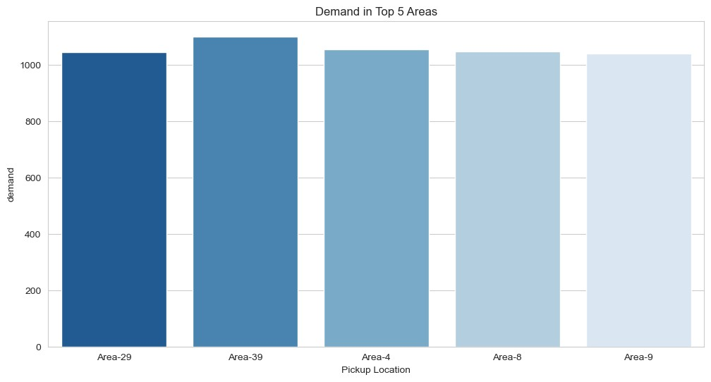
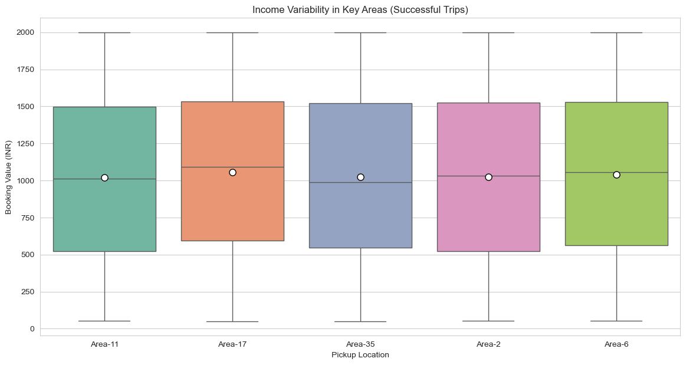
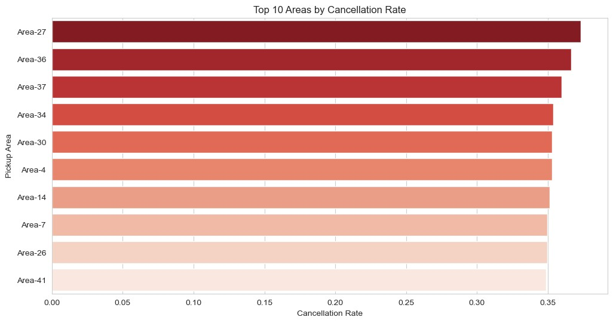
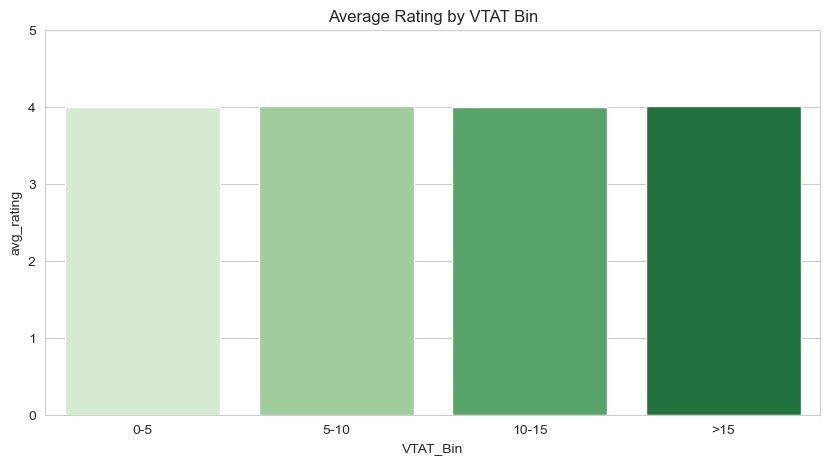
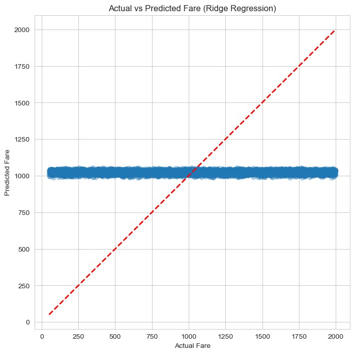
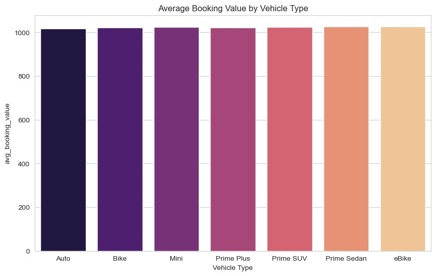

<p align="center">
  
  
  
  
  
</p>

<h1 align="center">Ola Bangalore Efficiency Analysis</h1>
<p align="center">
  <em>Business Data Management Capstone — IIT Madras BS in Data Science</em>
</p>

<p align="center">
  A data-driven investigation into <strong>cancellations, driver earnings, payment behavior, and service quality</strong> using 50,000+ Ola Bangalore ride records.
</p>

---

##  Overview

Every day in Bengaluru, thousands of ride-hailing decisions shape how well Ola works for both riders and drivers. This project turns 50,000+ raw booking records into actionable business insights, helping understand:

- **Why cancellations spike** and how they destabilize driver earnings
- **How payment methods** influence ride completion and customer experience
- **Whether waiting times** predict cancellations and lower ratings

Built as the capstone for IIT Madras's BDM course, this analysis follows the full data analytics lifecycle — from cleaning and feature engineering through exploratory analysis, statistical testing, and business recommendations.

---

##  Key Findings

| Problem | Finding |
|---------|---------|
| **Cancellations & Earnings** | Cancellation rates concentrate in specific peak hours and high-density pickup zones. These same pockets exhibit the highest volatility in driver take-home earnings. |
| **Payment Methods** | Digital payments (UPI, wallets) associate with measurably higher completion rates and more consistent ratings compared to cash-based rides. |
| **Waiting Time & Quality** | Longer VTAT/CTAT correlates with higher cancellation risk and lower customer ratings, especially in congested areas during peak hours. |

---

##  Visualizations

| Figure | Description |
|--------|-------------|
|  | **Top 10 pickup areas by cancellation rate** — cancellations concentrate in specific zones |
|  | **Cancellation rate by hour of day** — evening and late-night hours show clear spikes |
|  | **Cancellation rate vs earnings volatility** — high-cancellation zones also have most volatile driver income |
|  | **Completion rates by payment method** — digital payments outperform cash |
|  | **Cancellation rate by payment method** — cash rides cancel more frequently |
|  | **Average booking value by vehicle type** — fare variation across Mini, Sedan, Prime, Auto, Bike |
|  | **Correlation heatmap** — relationships between numerical features |
|  | **Driver earnings in high- vs low-cancellation areas** — income stability comparison |

---

##  Repository Structure

```
BDM_OLA/
├── 24f2000232_OLA_BDM.docx       # Full project report (documentation, methodology, findings)
├── OLA_BDM.ipynb                  # Analysis notebook (data cleaning, EDA, visualization, modeling)
├── Bengaluru_Ola_Booking_Data.csv # Raw dataset
└── images/                        # Extracted figures from the report
    ├── figure1_avg_booking_value_by_vehicle.png
    ├── figure3_correlation_heatmap.jpg
    ├── figure4_top10_cancellation_rate.jpg
    ├── figure6_cancellation_vs_volatility.jpg
    ├── figure8_earnings_high_vs_low_cancel.jpg
    ├── figure9_cancellation_by_hour.png
    ├── figure13_completion_by_payment.jpg
    └── figure14_cancellation_by_payment.jpg
```

---

##  Analytics Pipeline

```
Raw CSV → Data Cleaning → Feature Engineering → Exploratory Analysis → Statistical Modeling → Business Recommendations
```

**Techniques used:**
- Data cleaning and preprocessing (missing value handling, type casting, outlier treatment)
- Temporal feature engineering (hour of day, day of week, peak/off-peak flags)
- Descriptive statistics and distribution analysis
- Segmentation by pickup area, vehicle type, payment method, and time window
- Correlation analysis between operational metrics and service quality
- Minimal fare modeling (multiple regression approaches)
- Data visualization for pattern communication

---

##  Tech Stack

| Component | Tool |
|-----------|------|
| **Language** | Python 3.10+ |
| **Data Processing** | pandas, numpy |
| **Visualization** | matplotlib, seaborn |
| **Modeling** | scikit-learn |
| **Environment** | Jupyter Notebook |
| **Report** | Microsoft Word (docx) |

---

##  Getting Started

```bash
# Clone the repo
git clone https://github.com/SarangRao20/BDM_OLA.git
cd BDM_OLA

# Install dependencies
pip install pandas numpy matplotlib seaborn scikit-learn

# Launch the notebook
jupyter notebook OLA_BDM.ipynb
```

---

##  Results & Recommendations

### For Operations
- Target high-volatility zones with dynamic driver incentives during peak hours
- Improve ETA accuracy and driver positioning in congested pickup areas

### For Product
- Nudge riders toward digital payment methods through in-app incentives
- Surface estimated wait times more transparently to manage rider expectations

### For Drivers
- Stabilize earnings in volatile areas through guaranteed minimums during identified peak windows
- Provide area-specific earnings insights to help drivers choose optimal zones

---

##  Limitations

- Secondary dataset — no access to Ola's internal surge pricing, promotion, or routing logic
- VTAT/CTAT fields missing for a significant portion of rides
- Fare modeling limited by absence of contextual pricing variables

---

##  Author

**Sarang Rao**  
IIT Madras — BS in Data Science and Applications  
[GitHub](https://github.com/SarangRao20) · [LinkedIn](https://linkedin.com/in/sarang-rao-262bbb324)

---

<p align="center">
  <sub>Built for the BDM Capstone — IIT Madras Online BS Degree Program</sub>
</p>
